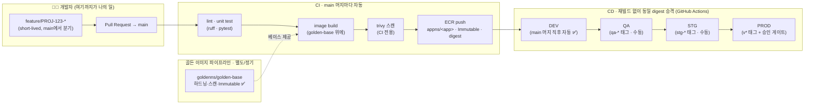

# cicdrepo — How to Contribute (정본 진입점)

> **한 줄 목적: How do I contribute to this project, and how does my code reach each environment?**
> 이 저장소는 "코드를 어떻게 기여하고 → 어떻게 DEV/QA/STG/PROD로 배포되는가"를 정의하는 **단일 정본(source of truth)** 입니다.
> 이 README는 **진입점(index)** 이고, 상세는 아래 4개 문서로 나눠 둡니다. 한 파일에 다 담지 않습니다.

| 항목 | 값 |
|---|---|
| 소유(Owner) | 황정효 (DevOps/Platform) |
| PROD 승격·승인 | DevOps 관리자 |
| 아키텍처 | Trunk-based · Build Once Deploy Many · GitHub Actions CD |
| 상태 라벨 | ✅ 구현됨 · 🟡 설계/계획 · ⚠️ 알려진 한계 |

---

## 📚 문서 인덱스 — 무엇을 볼지

| 알고 싶은 것 | 문서 | 대상 |
|---|---|---|
| **① 전체 브랜치 전략 + CI/CD 프로세스 큰 그림** | 이 README (아래) | 전원 |
| **② 내가 코드를 기여하려면** (브랜치 따기·명명·프리픽스·PR·커밋) | [`CONTRIBUTING.md`](./CONTRIBUTING.md) | 개발자 |
| **③ 각 환경(DEV/QA/STG/PROD)에 어떻게 배포되나** (CD 설계·승격·롤백) | [`docs/DEPLOYMENT.md`](./docs/DEPLOYMENT.md) | DevOps |
| **④ 골든 이미지(Golden Image) 파이프라인 관리** | [`docs/GOLDEN-IMAGE.md`](./docs/GOLDEN-IMAGE.md) | DevOps |

> **읽는 순서:** 개발자는 `CONTRIBUTING.md` 하나면 PR을 낼 수 있습니다. DevOps는 `DEPLOYMENT` → `GOLDEN-IMAGE` 순으로 봅니다.
> ⚠️ 과거 단일 `PLATFORM.md`의 내용은 이제 `docs/DEPLOYMENT.md`(배포·승격·롤백)와 `docs/GOLDEN-IMAGE.md`(골든 이미지)로 **분리·정본화**되었습니다.

---

## ① 전체 그림 — branch → build → promote



### 핵심 원칙 4가지
1. **`main` = trunk = 항상 릴리스 가능.** 장수 브랜치(`develop`/`qa`/`stg`)를 두지 않습니다(≠ GitFlow). **환경은 브랜치가 아니라 배포 상태**입니다.
2. **Build Once, Deploy Many.** 커밋 SHA당 이미지 1개를 만들고, **같은 digest**를 그대로 승격합니다. 환경 차이는 이미지가 아니라 **설정(app-config/feature-flags)** 으로만 표현합니다.
3. **승격 = 새 빌드가 아니라 digest 이동.** DEV에서 검증한 `sha256:...`이 재빌드 없이 QA→STG→PROD로 이동합니다. → "테스트한 것 = 배포한 것"을 digest가 보장.
4. **미서명·비승인 이미지 차단(목표).** 스캔·화이트리스트로 우발적 취약점을 막고, 서명 검증·Admission으로 의도적 변조를 막습니다. ⚠️ *현재는 강제 지점이 CI에만 있음(Admission·서명은 로드맵) — [`docs/DEPLOYMENT.md`](./docs/DEPLOYMENT.md) §위협모델.*

---

## ⚡ 30초 요약 (개발자)

```bash
git switch main && git pull
git switch -c feature/PROJ-123-add-login     # ① 브랜치 따기 (main에서)
# ...작업...
git commit -m "feat(auth): add login endpoint"  # ② 커밋 (Conventional Commits)
git push -u origin HEAD                          # ③ 푸시
# GitHub에서 PR → CI 초록불 + 리뷰 1인 → Squash and Merge   ④
```

**머지하는 순간부터 자동**입니다: 이미지 빌드 → DEV 자동 배포. 여러분은 DEV에서 본인 변경을 확인만 하면 됩니다.
막혔을 때는 → [`CONTRIBUTING.md` §CI 빨간불](./CONTRIBUTING.md).

---

## 🗂️ 저장소 레이아웃 (현황 · 🟡 일부 확정 필요)

```
cicdrepo/
├── src/                         # 애플리케이션 소스 (Python)
├── build/golden/                # 골든(base) 이미지 정의 (Dockerfile @sha256 pin)
├── deploy/                      # 배포 매니페스트 (환경 차이는 여기서만)
│   ├── base/                    # 🟡 Kustomize base (로드맵)
│   └── overlays/{dev,qa,stg,prod}/   # image digest + app-config 만 상이
├── .github/workflows/           # CI/CD (golden-image · build-push · deploy.reusable · deploy-{qa,stg,prod})
├── CONTRIBUTING.md              # ② 기여 가이드
└── docs/
    ├── DEPLOYMENT.md            # ③ CD 설계 (환경별 배포·승격·롤백)
    └── GOLDEN-IMAGE.md          # ④ 골든 이미지 파이프라인
```

**현황(확인값):** ECR `goldenns/golden-base` ✅ Immutable/AES-256 · 앱 repo `appns/<app>` Immutable(digest) ✅ · 네임스페이스 `dev/qa/stage/prod` ✅ · 인증 GitHub OIDC 키리스 ✅ · Kustomize overlays/Terraform/서명/Admission은 🟡 로드맵.

---

## 📎 References (1차 자료, 문서별 분리)
- **브랜치 전략·기여 가이드** → `CONTRIBUTING.md` 하단 (trunkbaseddevelopment.com, awesome-contributing 등)
- **CD 승격·롤백·공급망 서명** → `docs/DEPLOYMENT.md` 하단 (AWS Prescriptive Guidance, SLSA, Sigstore/Cosign 등)
- **골든 이미지 파이프라인** → `docs/GOLDEN-IMAGE.md` 하단 (HashiCorp Packer, EC2 Image Builder, AWS Security Maturity 등)

## 문의
- 파이프라인/게이트/배포: `#platform-devops`
- 이 문서 수정 제안: `docs/` 프리픽스 브랜치로 PR
