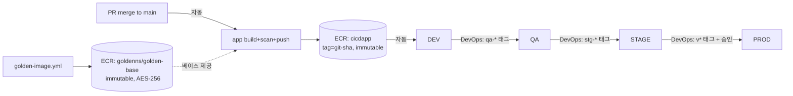

# cicdrepo — CI/CD 파이프라인 규범 (Single Source of Truth)

> 이 문서는 cicdrepo의 **유일한 규범 문서**입니다. 다른 사본이 있다면 이 문서가 우선합니다.
> 설계 결정에는 근거가 있으며, 알려진 한계는 숨기지 않고 §7 로드맵에 기록합니다.
> 원칙 하나: **"설정했다 ≠ 작동한다."** 통제는 통과가 아니라 **실패 케이스로 검증**합니다.

| 항목 | 값 |
|---|---|
| 소유자(Owner) | 황정효 (DevOps) |
| PROD 승격/승인 | DevOps 관리자 |
| 문서 버전 | v4 (통합 정본) |
| 최종 수정 | 2026-07-12 |
| 상태 라벨 | ✅ 구현됨 · 🟡 계획/부분 · ⚠️ 알려진 한계 |

---

## 0. 이 문서 읽는 법 (2개 동선)

한 문서지만 독자별로 읽는 경로가 다릅니다.

- **개발자** → §1 빠른 시작 · §2 기여 가이드 · §3 환경별 배포 확인. "그래서 나는 뭘 하면 되나"만 담겨 있습니다.
- **DevOps/플랫폼** → §4 아키텍처·설계 결정 · §5 골든 이미지·보안 게이트 · §6 위협 모델 · §7 로드맵. "왜 이렇게 놓았고 어디가 약한가"를 담습니다.

> 여러분(개발자)이 할 일은 **브랜치 따고 → PR 올리는 것**까지입니다. 그다음은 파이프라인이 자동으로 흐릅니다.

---
---

# 🟦 개발자 레인 (§1–§3)

## 1. 빠른 시작

```bash
git checkout main && git pull origin main
git checkout -b feature/<짧은-설명>
# 작업 + 로컬 검증
pytest -q                          # (lint 포함 시: ruff check . && pytest -q)
git push -u origin feature/<짧은-설명>
# GitHub에서 PR → CI green + 리뷰 1인 승인 → Squash and Merge → 브랜치 삭제
```

머지되면 **DEV에 자동 배포**됩니다. 여러분은 DEV에서 본인 변경을 확인만 하면 됩니다.
스캔(trivy)은 **CI에서만** 돕니다. 로컬에서 따로 돌릴 필요 없이 CI 로그로 결과를 봅니다.

## 2. 기여 가이드

### 2-1. 브랜치 이름
`prefix/짧은-설명` (kebab-case). prefix로 목적을 표시합니다.
- `feature/` 신규 · `fix/` 버그 · `hotfix/` 운영 긴급 · `ci/` 파이프라인 · `chore/` 빌드·설정·문서
- 예: `feature/add-cicd-app`, `fix/upgrade-python-deps`
- **환경명 서픽스(`-dev`, `-prod`) 금지.** 환경은 브랜치가 아니라 배포 상태입니다.

### 2-2. 커밋 & PR
- 커밋: `<type>: <요약>` (Conventional Commits). Squash 머지라 **PR 제목이 최종 커밋 메시지**가 됩니다.
- `main` 직접 push 금지 — PR로만. 머지 조건: **CI green + 1인 승인**, 방식은 Squash and Merge.

### 2-3. push했는데 왜 배포가 안 되나요?
**push ≠ merge.** push는 원격 feature 브랜치에 올리는 것이고, 실제로 `main`에 들어가 DEV 배포가 트리거되는 건 **머지 시점**입니다.

### 2-4. CI가 빨간불일 때 (가장 자주 보는 곳)
실패 단계로 나눠 판단하세요. **내가 고칠 것 vs DevOps에 알릴 것**:

| 실패 단계 | 원인 | 내가 할 일 |
|---|---|---|
| `lint`/`test` | 스타일·테스트 깨짐 | 로컬 `ruff check . && pytest -q` 재현 후 수정 |
| 베이스 검사 | 비승인(비-골든) 런타임 사용 | 골든 베이스(digest pin)로 교체 |
| 이미지 스캔 | 내가 링크한 의존성 취약점 | **의존성/빌드 버전 상향**이 1순위 해결 |
| 빌드·push·서명 | 대개 인프라 이슈 | 코드 문제 아님 → `#devops`에 로그 링크 문의 |

- 미패치 CVE로 막혔고 실제 영향이 없다면 `.trivyignore` 예외를 **만료일·사유·승인자**와 함께 요청. (§5-4)

### 2-5. 미완성 기능을 main에 넣어도 되나요?
됩니다. 단 **feature flag로 감싸** 배포는 하되 노출은 막습니다(deploy ≠ release). 🟡 *현재 flag 체계는 계획 단계입니다(§7). 도입 전까지는 리뷰로 미완성 노출을 막습니다.*

### 2-6. 실행 중 파드를 kubectl로 직접 고쳐도 되나요?
**안 됩니다.** 재시작·다음 배포 때 유실되고 이력이 깨집니다(configuration drift). 변경은 재빌드 → 새 digest → 재배포로만. distroless라 `kubectl exec`가 안 되면 `kubectl debug`(ephemeral container)를 쓰세요.

## 3. 환경별 배포 (개발자가 확인할 것)

| 환경 | 언제 뜨나 | 개발자가 할 일 | 네임스페이스 |
|---|---|---|---|
| **DEV** | main 머지 직후 자동 | 본인 변경 1차 확인 | `dev` |
| **QA** | DevOps가 `qa-*` 태그 | QA sign-off 대상, 이슈 시 재작업 | `qa` |
| **STAGE** | DevOps가 `stg-*` 태그 | 통합/리허설 확인 | `stage` |
| **PROD** | DevOps가 `v*` 태그 + 승인 | 배포 후 기능·지표 확인 | `prod` |

- 승격 트리거(태그 생성)는 **DevOps 관리자**가 수행합니다. 개발자는 **DEV 확인 + 승격 요청**.
- 내 변경이 DEV에 떴는지 확인:
```bash
kubectl rollout status deployment/<app> -n dev
kubectl get deploy <app> -n dev -o jsonpath='{.spec.template.spec.containers[0].image}'; echo
# @sha256:... digest 형태여야 정상
```
- 롤백(긴급): `kubectl rollout undo deployment/<app> -n <ns>` — 단 이미지(파드 템플릿)만 되돌립니다. ConfigMap 변경은 별도 확인.

---
---

# 🟩 DevOps 레인 (§4–§7)

## 4. 아키텍처 & 설계 결정

### 4-1. 두 불변 원칙
1. **Trunk-based** — `main` 단일 통합 브랜치. 장수 환경 브랜치 없음. 환경 = 배포 상태.
2. **Build Once, Deploy Many** — 커밋 SHA당 이미지 1개, 동일 **digest**를 전 환경에 승격. 환경 차이는 이미지가 아니라 **ConfigMap**으로만.

### 4-2. 전체 흐름


### 4-3. 설계 결정 & 근거

**Q. 왜 GitFlow가 아니라 trunk-based?**
장수 브랜치는 `main`과 diff가 벌어져 머지 충돌이 커지고, `develop` 저수지 구조는 기능이 릴리즈 주기에 인질로 잡히고 장애 원인 특정을 어렵게 합니다. *반례: 다중 버전 동시 지원(DB·SDK·온프렘)이면 GitFlow가 옳음. 우리는 단일 버전 서비스라 trunk-based.*

**Q. 왜 태그 승격이고 단위가 digest?**
태그는 재지정 가능한 이름표라 같은 태그가 다른 내용을 가리킬 수 있습니다. digest는 SHA-256이라 같으면 반드시 같은 바이트. "테스트한 것 = 배포한 것"을 보장하려면 승격 단위가 digest여야 합니다. 재빌드하면 의존성 해결이 달라져 그 보장이 깨집니다.

**Q. DEV 자동 vs QA 반자동 기준?**
"이 배포 시점을 사람이 정해야 할 이유가 있는가." DEV는 실사용자 영향이 없어 자동. "모든 기능 완료"는 기계가 감지 못 하므로 QA는 태그를 찍는 **한 번의 수동 결정**으로 프리징하고 이후는 자동. *QA를 DEV(머지 트리거)에 붙이면 검증 중 코드가 바뀌는 moving target 문제 발생 → 고정 태그로 프리징.*

### 4-4. 워크플로 구조 (모범사례: reusable + 환경별 호출)
🟡 *권장 구조. 실제 리포 현황과의 격차는 §7 로드맵.*

| 워크플로 | 역할 |
|---|---|
| `golden-image.yml` | 골든 베이스 빌드·스캔·push (goldenns/golden-base) |
| `build-push.yml` | 앱 CI + 스캔 + push + **DEV 배포** |
| `deploy.reusable.yml` | 공통 배포 로직(digest 조회→set image→rollout→헬스체크→실패 시 롤백) |
| `deploy-qa / -stage / -prod.yml` | 얇은 호출. 환경명·**환경별 OIDC 역할**·승인 게이트만 다르게 |

이 하이브리드가 DRY(중복 제거) + 환경별 권한 분리(blast radius↓) + PROD 승인 격리를 모두 만족합니다.

## 5. 골든 이미지 & 보안 게이트

### 5-1. 골든 이미지 관리 ≠ 버전 관리
버전 관리는 "무엇을 쓰는지"만 알려주고 "안전한지"는 못 알려줍니다. 골든 파이프라인이 관리하는 축은 **승인·안전성·투명성·식별·진위**. 증거는 **정기 재스캔** — Dockerfile이 안 바뀌어도 매주 돌립니다(같은 버전이 어제 안전, 오늘 위험할 수 있으므로).
현황: `goldenns/golden-base` ✅ Immutable + AES-256 (ECR 확인됨).

### 5-2. 방어 순서 (스캔은 마지막)
스캐너는 아는 것만 찾습니다. 그래서 앞에 **화이트리스트(distroless + digest pin)와 EOL 차단**을 둡니다(스캐너 지식에 비의존). 스캔은 마지막에서 "그 앞을 통과한 것 중 알려진 취약점"만 잡습니다.

### 5-3. 실패에서 배운 것 (검증 기록)
- **① EOL = 스캔 0건:** EOL 배포판은 보안 공지가 끊겨 CVE 데이터가 없어 **0건 = "안전"이 아니라 "탐지 불가."** 대응: 화이트리스트 차단 + EOL 경고를 exit 1로. (debian 10은 EOL인데 239건 → "EOL이면 0건" 규칙조차 안 서므로 **EOL 경고 자체를 차단 신호**로)
- **② IMMUTABLE인데 취약 이미지 등록:** `workflow_dispatch` 기본값 탓에 EOL 이미지가 `1.0.0` 태그로 등록됨. **태그 불변성은 무결성 장치이지 품질 장치가 아님.**
- **③ 골든 베이스 깨끗한데 앱 CRITICAL:** 빌드 스테이지의 낡은 런타임이 컴파일한 바이너리에 취약 stdlib 정적 링크. **digest pin은 재현성을 주지 안전성을 주지 않음.** 근본 대응은 빌드 이미지 거버넌스(빌드 `FROM`/`COPY --from` 검사).

### 5-4. CVE 예외(.trivyignore) 운영
골든 이미지는 **OS 레이어만** 덮으므로, 앱 의존성·미패치 CVE는 스캔 게이트가 따로 잡고 예외 장치가 필요합니다.

| 상황 | 처리 |
|---|---|
| 패치 있는 CVE | **예외 금지.** 버전 상향으로 제거 |
| 미패치 + 코드 미사용 | `.trivyignore`에 **만료일 + 사유 + 승인자** 기록 후 통과 |
| 미패치 **CRITICAL** | 무료 통과 금지. `--ignore-unfixed`로 숨기지 말고 예외로 **명시 관리(가시화)** |
| 골든 베이스 CVE | 앱이 아니라 **골든 파이프라인 쪽 예외**로 관리 |

규율: 만료일 필수(영구 면죄부 방지) · CODEOWNERS로 보안팀 승인 강제 · 예외는 최소·한시적. **목표는 "완벽한 통제"가 아니라 "지속 가능한 통제."**

## 6. 위협 모델 (알려진 한계)

### 6-1. 가장 큰 구멍 — 강제 지점이 CI에만 ⚠️
CI를 우회한 `kubectl apply`로 임의 이미지를 직접 배포하면 화이트리스트·스캔·SBOM을 전부 우회합니다. 최후 방어선인 **Admission Controller(Kyverno/OPA)가 없어**, "골든에서 파생되지 않은 이미지는 뜰 수 없다"를 기계가 강제하지 못합니다. (§7)

### 6-2. 러너 blast radius ⚠️
CI 러너는 신뢰가 가장 집중된 노드입니다(ECR push + 클러스터 배포 + 서드파티 의존성 + PR 코드). **러너 탈취 = 골든 오염 + PROD 배포 동시 가능.** 폭발 반경을 가르는 통제가 **환경별 OIDC 역할 분리**(§7 '높음').

### 6-3. 승격 순서 미강제 ⚠️
현재 승격은 **강제가 아니라 신뢰**입니다. `qa-*` 태그 시 `ImageNotFound`는 "빌드된 적 없는 커밋"만 거를 뿐, "실제로 QA를 통과한 커밋인가"는 검증하지 않습니다. → §7 '태그 남용 방지'.

### 6-4. 우발적 취약점엔 강하나 의도적 변조엔 약함 ⚠️
스캔·화이트리스트는 **결함(CVE)** 을 잘 잡지만, 의도적 백도어는 CVE가 아니라 통과하고 서명·프로버넌스가 없어 "우리가 만든 이미지"임을 증명 못 합니다(공급망 공격에 약함). → §7 '서명/SLSA'.

### 6-5. Secret at-rest 🟡
현재 앱 Secret이 **없어** 노출면은 낮습니다. ConfigMap `app-config`는 `ENV_NAME`/`LOG_LEVEL` 등 **비민감값만** 보유(올바른 사용). 다만 Secret 도입 전에 **EKS etcd KMS 봉투 암호화**를 선제 적용하는 것이 baseline. 규칙: **민감값은 ConfigMap 금지, k8s Secret(+External Secrets) 사용.**

## 7. 로드맵 (우선순위: 합의→강제 · blast radius 축소 먼저)

### Tier 1 — 강제 지점 만들기 + 폭발반경 축소 (최우선)
- 🟡 **태그 남용 방지 4종** — ① 환경 승인 게이트(GitHub Environments Required reviewers, QA/STAGE까지 확장) ② 태그 보호 규칙(`qa-*`/`stg-*`/`v*` push 권한 제한) ③ 프로모션 순서 강제(선행 태그 계보 검증) ④ QA 통과 status-check 강제
- 🟡 **required checks + CODEOWNERS 강제** — 지금은 규칙일 뿐 기계적 차단 아님
- 🟡 **환경별 OIDC 역할 분리** (golden-publisher / app-ci / app-deployer)
- 🟡 **Admission Controller** (Kyverno/OPA) — 골든 파생·서명 검증을 파드 전 컨테이너에 강제
- 🟡 **Immutable 앱 repo 생성** — 현재 앱 전용 repo 없음(존재하는 `testns/testrepo`는 **Mutable** → promote-not-rebuild 위반). 예: `appns/cicdapp` Immutable 생성

### Tier 2 — 공급망 진위
- 🟡 **Cosign 서명 + 검증** (골든 우선) → Admission이 서명 검증까지
- 🟡 **SLSA provenance / attestation + SBOM 서명·바인딩**
- 🟡 **빌드 이미지 거버넌스** (빌드 `FROM`/`COPY --from` 검사) — 발견③의 근본 대응

### Tier 3 — 운영 신뢰성 & IaC
- 🟡 **Kustomize base + overlays{dev,qa,stage,prod}** — 환경 차이(image digest + app-config)만 오버레이. **stage/prod에 없는 app-config를 생성해 갭 해소**
- 🟡 **Terraform** (ECR/IAM/OIDC 선언화)
- 🟡 **feature flag** — P0 kill-switch(파일 마운트 ConfigMap, 무중단 토글) → P1 per-feature → P2 OpenFeature/감사
- 🟡 **etcd KMS 암호화** (Secret 도입 전 선제)
- 🟡 **rollout/replica/PDB/HPA 표준** — 미정. 배포 성공=헬스체크 통과, 타임아웃 초과 시 자동 롤백
- 🟡 **앱 이미지 정기 재빌드** (stdlib CVE 지속 흡수)
- 🟡 **중기 GitOps(ArgoCD/Flux) 전환** — 러너가 클러스터 자격증명을 아예 안 갖게. *전환 시 '환경별 OIDC 역할 분리'는 PR 승인 흐름으로 흡수됨. 당장은 push 하드닝, 여유 시 전환(하이브리드 경로).*

---
---

## 부록 A. 리포 & 클러스터 현황 (확인값)
- ECR: `<ACCOUNT_ID>.dkr.ecr.<REGION>.amazonaws.com`
  - `goldenns/golden-base` ✅ Immutable, AES-256
  - 앱 repo 🟡 미생성 (임시로 존재하는 `testns/testrepo`는 Mutable — 사용 금지)
- 네임스페이스: `dev` `qa` `stage` `prod` ✅
- ConfigMap: `app-config` (dev·qa에만 존재 🟡, stage·prod 없음) — 키 `ENV_NAME`, `LOG_LEVEL`
- Running Deployment: **현재 없음** 🟡 (앱 배포 파이프라인 미완)
- 인증: GitHub OIDC(키리스) ✅ — 정적 AWS 키 없음

## 부록 B. 핵심 검증 명령
```bash
# 배포 확인 (컨테이너명 정확해야 함 — 오타 시 set image가 silent no-op)
kubectl get deploy <app> -n <ns> -o jsonpath='{.spec.template.spec.containers[*].name}'; echo
kubectl rollout status deployment/<app> -n <ns>

# ConfigMap 환경 차이 확인
kubectl get cm app-config -n dev -o jsonpath='{.data}'; echo
kubectl get cm app-config -n qa  -o jsonpath='{.data}'; echo

# distroless 디버깅
kubectl debug -n <ns> -it <pod> --image=busybox --target=<app>

# 골든 서명 검증(서명 도입 후)
cosign verify --certificate-oidc-issuer https://token.actions.githubusercontent.com \
  --certificate-identity-regexp '.*github.com/<org>/<repo>.*' <image@digest>
```

## 부록 C. 용어
- **digest** — 이미지 내용의 SHA-256. 같으면 반드시 같은 바이트. 승격의 단위.
- **골든 이미지** — 승인·하드닝·스캔·서명된 표준 베이스. OS 레이어만 커버.
- **promote-not-rebuild** — 재빌드 없이 검증된 digest를 다음 환경으로 이동.
- **blast radius** — 한 요소가 뚫렸을 때 피해가 미치는 범위.
- **moving target** — 검증 중 대상 코드가 밑에서 바뀌는 문제.

## 변경 이력
- **v4 (2026-07-12)** — 3개 초안 통합 단일 정본화. 2개 동선(개발자/DevOps) 구조, 위협모델·로드맵 독립. 실제값 반영(ConfigMap `app-config`, running deployment 없음, golden-base Immutable+AES256). 결정 확정: 태그 `qa-*`/`stg-*`/`v*`, reusable 워크플로 하이브리드, `--ignore-unfixed` + CRITICAL 예외 라우팅, 중기 GitOps, 승격 주체=DevOps 관리자, Python 스택, trivy CI 전용. 계정ID/리전 스크럽.
- v3 이전 — 초기 파이프라인 규범·위협모델·발견①~④ 기록.
