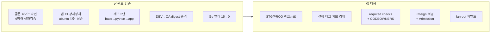
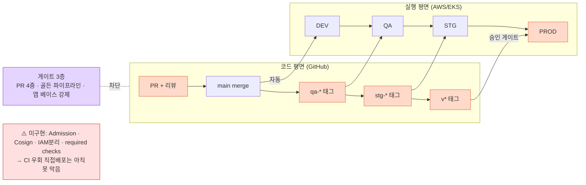

# STATUS — 프로젝트 전체 현황 & 로드맵 (Golden Image · CD)

> **범례:** ✅ 실습으로 검증 완료 · 🟡 설계 완료/구현 예정 · ⚠️ 알려진 한계
> **원칙:** Trunk-based · Build Once Deploy Many · "설정했다 ≠ 작동한다"(실패 케이스로 검증)
> 본 문서는 `cicd` 프로젝트 전체 작업 + 최근 세션 작업을 합산한 현황입니다.

---

## TL;DR (3줄)
- **골든 이미지:** 발행 측(골든 파이프라인 빌드·화이트리스트·EOL·스캔)과 **소비 측(앱 CI 베이스 강제)** 양쪽 방어를 심고 **6개 전부 실패 케이스로 검증**. 언어별 골든 파생·계보 3단까지 완료. ✅
- **CD:** trunk-based + digest 승격으로 DEV→QA 관통 실증, **앱 CI 강제 장치 작동 확인**, STG/PROD **설계 확정**(태그+승인). 승격 순서 `DEV→QA→STG→PROD` 확정. ✅/🟡
- 남은 핵심은 **STG/PROD 워크플로 구현 · 선행 태그 계보 강제 · required checks · Cosign 서명 · Admission**. 🟡

---

## 성숙도 한눈에

---

## Part 1 — 골든 이미지(Golden Image) 파이프라인 관리

### ✅ 완료 (발행 측 — 골든을 만드는 파이프라인)
| 항목 | 내용 | 검증 |
|---|---|---|
| 골든 베이스 | Debian 13 trixie distroless, 하드닝(비루트) | `goldenns/golden-base@c966fe8…` Immutable+AES256 |
| **언어별 골든 파생** | golden-base 위 Python 3.13.5 이식(멀티스테이지·glibc 정합) | `goldenns/golden-python@5c922f5…` |
| **계보 라벨** | 각 이미지가 부모 digest 라벨 보유 | python→c966fe8, app→5c922f5 |
| 화이트리스트 차단 | 비승인 베이스 거부 | `ubuntu:20.04` 차단 ✅ |
| EOL 차단 | EOL 배포판 거부 | (화이트리스트가 선행) |
| 스캔 게이트 | CRITICAL/fixable HIGH 차단 | `node:16` 239개 차단 ✅ |
| 불변·암호화 | 골든/앱 repo Immutable+AES256 | ECR 확인값 |

### ✅ 완료 (소비 측 — 앱이 골든을 쓰게 강제) ★ 최근 확인
| 항목 | 내용 | 검증 |
|---|---|---|
| **앱 CI 베이스 강제** | 앱 Dockerfile의 런타임 FROM이 골든이 아니면 exit 1 | `Enforce golden base image`가 `ubuntu:20.04` **차단, 빌드 skip** ✅ |
| golden digest 존재 검증 | 앱이 참조한 골든 digest가 ECR에 실재하는지 확인 | `Verify golden image exists` |
| 앱 이미지 스캔 게이트 | 앱 취약점 차단 | Go stdlib 15개 차단 → 수정 ✅ |
| **빌드 스테이지 수정** | Go 빌더 취약점 제거 | `golang:1.25@d7912ced` 로 15→0, main 머지 ✅ |
| 앱 파생 | 앱을 `FROM golden-python`으로 재빌드 | `appns/killswitch-demo:0.2.0-golden@c4a8a38…` |

### ✅ 실패 케이스로 발견한 것 (직접 해봐야 아는 4가지)
1. **EOL 이미지가 스캔 0건 통과** → 스캔은 마지막 방어선, 화이트리스트가 먼저.
2. **`default: 1.0.0`이 취약 이미지에 정식 태그 부여** → 기본값도 공격 표면.
3. **골든 베이스는 깨끗한데 앱이 취약**(빌드 스테이지 stdlib) → 빌드 이미지도 통제 대상.
4. **`if: always()`가 진짜 원인을 덮음** → 에러 설계도 파이프라인의 일부.

### 🟡 계획
| 우선 | 항목 |
|---|---|
| 높음 | 정기 재스캔 + CVE 트리거 재빌드 자동화 |
| 높음 | 라벨 기반 **fan-out 재빌드**(golden 패치→하위 앱 자동 재빌드) |
| 높음 | artifact revocation(옛 골든 참조 차단) · 빌드 이미지 거버넌스(`COPY --from` 검사) |
| 중간 | SBOM(Syft) + **Cosign 서명** + attestation |

---

## Part 2 — CD (DEV/QA/STG/PROD) 설계

### ✅ 완료 (설계 확정 + 실증)
| 항목 | 내용 | 증거 |
|---|---|---|
| **DEV 자동 배포** | main 머지 직후 자동(OIDC→build→scan→push→deploy) | 워크플로 실행·dev running |
| **digest 승격 실증** | 같은 digest DEV→QA, 응답만 `[development]`→`[qa]` | 이미지 동일, config만 상이 |
| 승격 순서 확정 | `DEV→QA→STG→PROD` (태그 qa-*/stg-*/v*) | STG=리허설이 순서 강제 |
| **STG/PROD 설계 확정** | STG=`stg-*` 태그 / PROD=`v*` 태그+**Environments 승인** | = Continuous Delivery 채택 |
| STG 역할 확정 | 배포 리허설·마이그레이션 검증 전용(회귀 반복 아님) | QA=기능, STG=릴리스 안전성 |
| feature flag(P0) | 파일 마운트 ConfigMap + 매 요청 재읽기 → 무중단 kill-switch | 토글 시 RESTARTS 0 |
| OIDC 키리스 | 정적 AWS 키 없이 push/deploy | 워크플로 동작 |
| 브랜치/기여 규칙 | trunk-based, prefix, Squash+1승인, Conventional Commits | CONTRIBUTING.md |

### 🟡 계획 (핵심 미구현)
| 우선 | 항목 | 왜 |
|---|---|---|
| 높음 | **STG/PROD 워크플로 구현** | 설계 확정, 코드 미작성(deploy-qa 복제 + PROD에 `environment:` 추가) |
| 높음 | **선행 태그 계보 강제** | `stg-*`는 `qa-*` 커밋에만, `v*`는 `stg-*` 커밋에만 — 환경 순서를 기계로 강제 |
| 높음 | **required checks + CODEOWNERS** | 현재 PR 게이트가 실제 머지를 못 막음(문서-현실 불일치) |
| 높음 | 환경별 OIDC 역할 분리 | 러너 blast radius 축소 |
| 중간 | Kustomize overlays · BG/Canary · rollout/PDB/HPA 표준 |  |
| 중간 | feature flag P1/P2(per-feature/canary→OpenFeature) · Terraform · etcd KMS |  |
| 낮음 | 중기 GitOps(ArgoCD/Flux) 전환 |  |

### ⚠️ 알려진 한계
- **강제 지점이 CI에만** — CI 우회 `kubectl apply` 방어선(Admission) 없음. (가장 큰 구멍)
- **러너 blast radius** — 골든 push + PROD 배포 권한 집중.
- **승격 순서 미강제** — 태그를 다른 커밋에 찍으면 환경 건너뛰기 가능(선행 태그 검증으로 막아야).
- **required checks 미설정** — PR 게이트가 머지를 실제로 못 막음.
- **의도적 변조에 약함** — Cosign 서명·provenance 미도입.

---

## 큰 그림 — 코드 평면 / 실행 평면

- **사람 개입 4곳:** PR 승인 · qa 태그 · stg 태그 · PROD 승인. 나머지 자동.
- **게이트 3층:** PR 게이트(4중) → 골든 이미지 파이프라인 → 앱 CI 베이스 강제.
- **아직 안 막은 곳까지** 그림에 그대로 표기(정직한 아키텍처).

---

## 다음 한 걸음 (추천 · 추정)
로드맵 원칙("합의→기계적 강제 + blast radius 축소")에 맞춰:
1. **required checks + CODEOWNERS 설정** — 지금 PR 게이트가 머지를 못 막는 문서-현실 불일치부터 해소.
2. **STG/PROD 워크플로 구현** — deploy-qa 복제 + PROD `environment:` 승인 + **선행 태그 계보 검증**.
3. **Cosign 서명 + Admission** — CI 우회 배포(가장 큰 구멍) 차단.
4. **fan-out 재빌드** — 라벨 기반 golden 패치 전파.

---

## 참고
- 기여·브랜치: [../CONTRIBUTING.md](../CONTRIBUTING.md) · CD: [DEPLOYMENT.md](./DEPLOYMENT.md) · 골든: [GOLDEN-IMAGE.md](./GOLDEN-IMAGE.md)
- 실습 검증 로그: [../VALIDATION_LOG.md](../VALIDATION_LOG.md)
